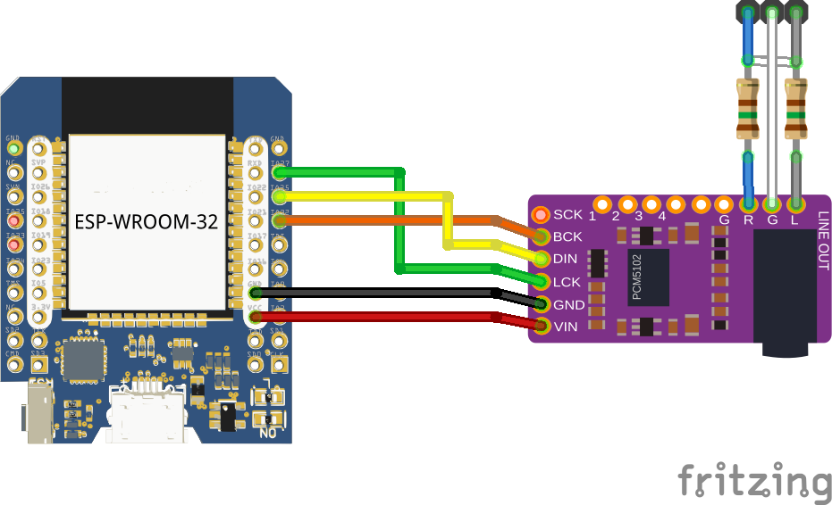
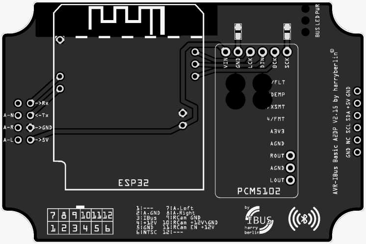
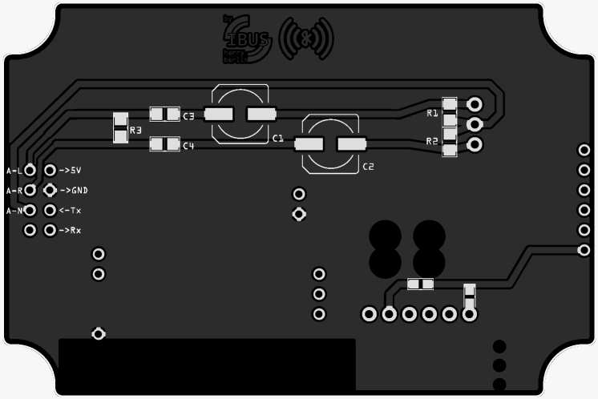

# AVR-IBus.A2DP `BT A2DP Extension for AVR-IBus Modul`
## Description
This will get an Extension Board for [AVR-IBus.public](https://github.com/harryberlin/AVR-IBus.public) Basic Modul.
To use the BMW Radio Mode [CD] as Bluetooth Audio Device.
 Steps:
-  design Extension PCB 
-  code ESP32 Code for Bluetooth A2DP
-  Side ESP32: code Communication with Atmega2560
-  Side Atmega2560: code Communication with ESP32
-  Code cleanup

## BOM
- ESP32
- PCM5102A
- ...

## Wiring
 

## PCB
 

## Commands & States

	
show

	
| Command    | Description                 |
| ---------- | --------------------------- |
| `CQ`       | Connection state Request    |
| `CP`       | Confirm Paring Pin          |
|            |                             |
| `MQ`       | Music state Request         |
| `MS`       | Music Stop                  |
| `MH`       | Music Pause                 |
| `MM`       | Music Play                  |
| `MP`       | Music Previous Track        |
| `MR`       | Music Fast Rewind           |
| `MF`       | Music Fast Forward          |
| `MN`       | Music Next Track            |
| `MQ`       | Music sate request          |
| `MQ`       | Music sate request          |
|            |                             |
| `TQ`       | Track Meta Data Request     |
|            |                             |
| `VU`       | BT Device Volume UP         |
| `VD`       | BT Device Volume DOWN       |
|            |                             |
| `EQ`       | 3Band EQ Requests           |
| `EU`       | Gain all Bands Up           |
| `ED`       | Gain all Bands Down         |
| `EB+`      | Gain Bass Up                |
| `EB-`      | Gain Bass Down              |
| `EM+`      | Gain Mid Up                 |
| `EM-`      | Gain Mid Down               |
| `ET+`      | Gain Treble Up              |
| `ET-`      | Gain Treble Down            |
| `EN`       | Gain Reset all Bands to 1.0 |
|            |                             |
| `SR`       | Settings Reseet             |
| `SN:MyName`| Set BT Device Name to `MyName`|

| States     | Description                 |
| ---------- | --------------------------- |
| `C0`       | Disconnected                |
| `C1`       | Connecting                  |
| `C2`       | Connected                   |
| `CA`       | Returns connected Sender MAC-Address `example CA:11:22:33:44:55:66`|
|            |                             |
| `M0`       | Music is stopped  or paused |
| `M1`       | Music is playing            |
| `M2`       | Music skips back or prev Track |
| `M3`       | Music fast rewind Track     |
| `M4`       | Music fast forward Track    |
| `M5`       | Music skips next Track      |
|            |                             |
| `TA`       | Track Artist                |
| `TT`       | Track Title                 |
| `TL`       | Track Album                 |
| `TP`       | Track Position (in seconds) |
| `TA`       | Track Length (in seconds)   |
|            |                             |
| `EL`       | Gain Bass Level `example EL:1.1`|
| `EM`       | Gain Mid Level `example EM:1.1`|
| `EH`       | Gain Treble Level `example EH:1.1`|

## Used Librarys:
- [ESP32-A2DP](https://github.com/pschatzmann/ESP32-A2DP) by pschatzmann
- [arduino-audio-tools](https://github.com/pschatzmann/arduino-audio-tools) by pschatzmann
- Arduino
- ESP32 Package by Espressif

## Project Progress/Milestones

show

 

