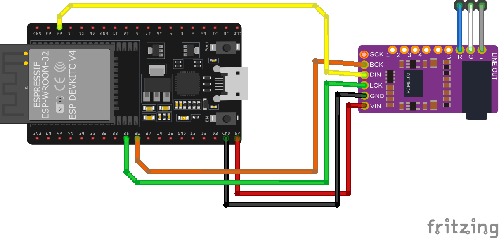
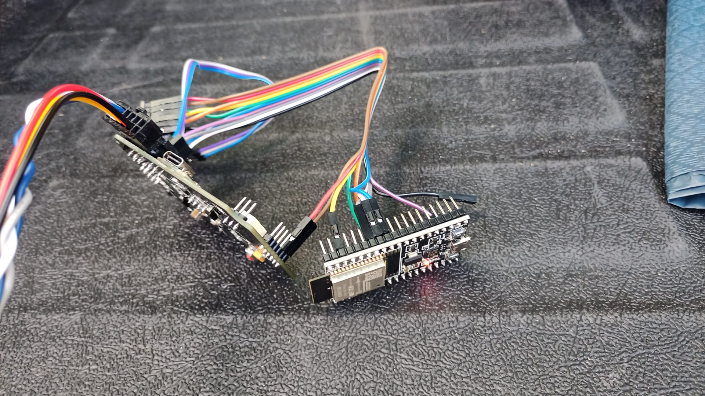
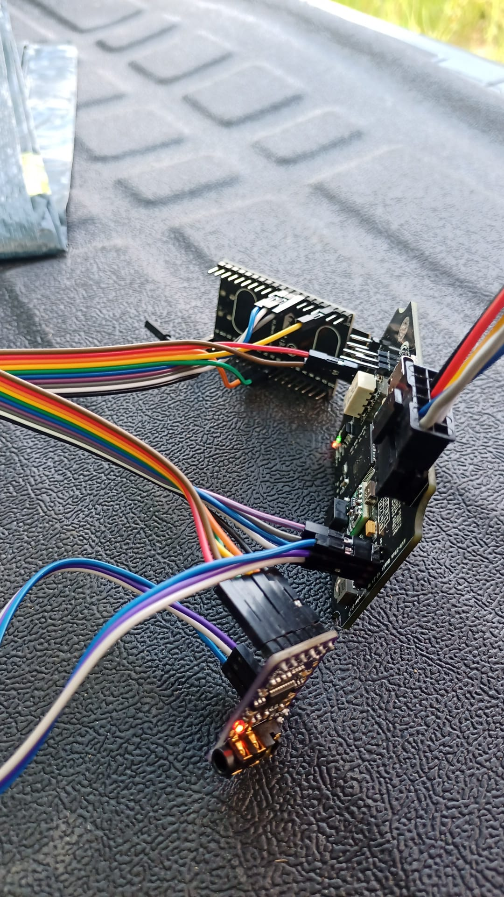

# AVR-IBus.A2DP `BT A2DP Extension for AVR-IBus Modul`
## Description
This will get an Extension Board for [AVR-IBus.public](https://github.com/harryberlin/AVR-IBus.public) Basic Modul.
To use the BMW Radio Mode [CD] as Bluetooth Audio Device.
 Steps:
- design Extension PCB 
- code ESP32 Code for Bluetooth A2DP 
- Side ESP32: code Communication with Atmega2560 
- Side Atmega2560: code Communication with ESP32 

## BOM
- ESP32
- PCM5102A
- ...

## Wiring

## Used Librarys:
- [ESP32-A2DP](https://github.com/pschatzmann/ESP32-A2DP) by pschatzmann
- [arduino-audio-tools](https://github.com/pschatzmann/arduino-audio-tools) by pschatzmann
- Arduino
- ESP32 Package by Espressif

## Project Progress/Milestones

show

 

